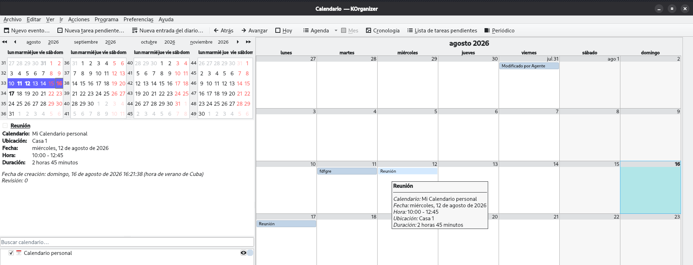

# agente_calendario

Agente conversacional para gestionar eventos del calendario.
Conversational agent to manage calendar events.

Utiliza un modelo de lenguaje (LLM) para interpretar instrucciones en lenguaje natural,
It uses a language model (LLM) to interpret natural language instructions,

genera un JSON con la acción y los parámetros, y ejecuta la operación correspondiente
generates a JSON with the action and parameters, and executes the corresponding operation

sobre el archivo ICS del calendario a través del módulo calendario_ics (su backend).
on the calendar ICS file through the calendario_ics module (its backend).


## Plataformas Soportadas (Probado con:) / Supported Platforms (Tested with:)

Esta herramienta ha sido probada oficialmente con los siguientes calendarios locales:
This tool has been officially tested with the following local calendars:

| Sistema Operativo | Aplicación                             | Estado       |
|-------------------|----------------------------------------|------------- |
| **Linux**         | KOrganizer (KDE Plasma 6)              | ✅ Probado   |
| **Windows**       | Rainlendar Lite 2.24.1 (Windows 10/11) | ✅ Probado   |
| **macOS**         | *No soportado actualmente*             | ❌ Pendiente |


## Instalación / Installation

```bash
pip install agente_calendario
```

### Con script / With script
```bash
# Para Linux / For Linux
# Copiar el script al directorio donde están los .py
chmod +x install.sh
./install.sh
```

```bash
# Para Windows / For Windows
# Abrir PowerShell
Set-ExecutionPolicy -Scope Process -ExecutionPolicy Bypass
.\install.ps1
``` 

## Configuración avanzada / Advanced configuration

Puedes especificar una ruta personalizada para los archivos `.ics` usando la variable de entorno `CALENDARIO_ICS_DIR`.  
You can specify a custom path for the `.ics` files using the `CALENDARIO_ICS_DIR` environment variable.

```bash
# Linux / macOS
export CALENDARIO_ICS_DIR="/ruta/a/tus/calendarios"
```
```bash
# Windows (PowerShell)
$env:CALENDARIO_ICS_DIR="C:\ruta\a\tus\calendarios"
```

```bash
# Windows (CMD)
set CALENDARIO_ICS_DIR=C:\ruta\a\tus\calendarios
```

Si no se define, el agente intentará detectar automáticamente la ruta según tu sistema operativo:

    Linux: ~/.local/share/apps/korganizer/

    Windows:  %USERPROFILE%\.rainlendar2\ (o su subcarpeta Calendar)

    macOS: No hay una ruta estándar para archivos ICS sueltos; usa la variable de entorno.

If not set, the agent will try to auto-detect the path based on your OS:

    Linux: ~/.local/share/apps/korganizer/

    Windows: %USERPROFILE%\.rainlendar2\ 

    macOS: No standard path for loose ICS files; use the environment variable.

## Dependencias / Dependencies

calendario_ics (se instala automáticamente / installed automatically)

Servidor llama.cpp en ejecución / llama.cpp server running

## Uso / Usage

# Iniciar el agente / Start the agent

```bash

# Usando la dirección y puerto por defecto (127.0.0.1:8082)
calendario-agent
```

```bash
# Especificando host y puerto / Specifying host and port
calendario-agent --host 192.168.1.10 --port 8080
```

## Ejemplo de sesión interactiva / Interactive session example

```bash

$ calendario-agent --host 127.0.0.1 --port 8082
======================================================================
AGENTE CONVERSACIONAL PARA GESTIONAR EVENTOS DEL CALENDARIO (con LLM)
======================================================================
Servidor LLM: 127.0.0.1:8082
Escribe instrucciones en lenguaje natural.
Ejemplos:
  - 'Lista los eventos de hoy'
  - '¿Cuántos eventos tengo para el 25 de julio?'
  - 'Agrega una reunión mañana desde las 10:00 hasta las 12:45'
  - 'Borra el evento con UID agente-123'
  - 'Elimina la reunión de mañana a las 10:00'
  - 'Dime los eventos de esta semana'
  - 'Cambia la reunión del jueves las 10:00 y ponla de las 11:00 a las 12:00'

Escribe 'salir' para terminar.

>>> Agrega una reunión mañana a las 10:00 en Oficina Central

[*] Enviando petición al LLM...

¡Perfecto! He agregado la reunión para mañana a las 10:00 en Oficina Central. ¿Necesitas algo más?

>>> ¿Cuántos eventos tengo para el jueves 25 de julio?

[*] Enviando petición al LLM...

Encontré 3 eventos para el jueves 25 de julio.

>>> Lista los eventos de hoy

[*] Enviando petición al LLM...

Estos son los eventos que tienes agendados para hoy:
  - Reunión con equipo (10:00 - 11:00)
  - Almuerzo con cliente (13:00 - 14:00)

>>> Borra la reunión de mañana

[*] Enviando petición al LLM...

Varios eventos coinciden. Elige uno:
1. Reunión con equipo - 2026-08-17 09:00
2. Reunión con cliente - 2026-08-17 10:30
Responde con el número del evento que quieres procesar.

>>> 2

Se ha eliminado la Reunión con cliente del jueves 17 de agosto a las 10:30. ¡Listo!

>>> Cambia la ubicación de la reunión de mañana a Sala 3

[*] Enviando petición al LLM...

Varios eventos coinciden. Elige uno:
1. Reunión con equipo - 2026-08-17 09:00
2. Reunión con cliente - 2026-08-17 10:30
Responde con el número del evento que quieres procesar.

>>> 1

He actualizado la ubicación de la Reunión con equipo a Sala 3. ¿Algo más?

>>> salir

¡Hasta luego!

```

## Ejemplo visual en el calendario KOrganizer / Visual in KOrganizer calendar


### `LICENSE`

MIT License

Copyright (c) 2026 Reinel G. Paredes

Permission is hereby granted, free of charge, to any person obtaining a copy
of this software and associated documentation files (the "Software"), to deal
in the Software without restriction, including without limitation the rights
to use, copy, modify, merge, publish, distribute, sublicense, and/or sell
copies of the Software, and to permit persons to whom the Software is
furnished to do so, subject to the following conditions:

The above copyright notice and this permission notice shall be included in all
copies or substantial portions of the Software.

THE SOFTWARE IS PROVIDED "AS IS", WITHOUT WARRANTY OF ANY KIND, EXPRESS OR
IMPLIED, INCLUDING BUT NOT LIMITED TO THE WARRANTIES OF MERCHANTABILITY,
FITNESS FOR A PARTICULAR PURPOSE AND NONINFRINGEMENT. IN NO EVENT SHALL THE
AUTHORS OR COPYRIGHT HOLDERS BE LIABLE FOR ANY CLAIM, DAMAGES OR OTHER
LIABILITY, WHETHER IN AN ACTION OF CONTRACT, TORT OR OTHERWISE, ARISING FROM,
OUT OF OR IN CONNECTION WITH THE SOFTWARE OR THE USE OR OTHER DEALINGS IN THE
SOFTWARE.
